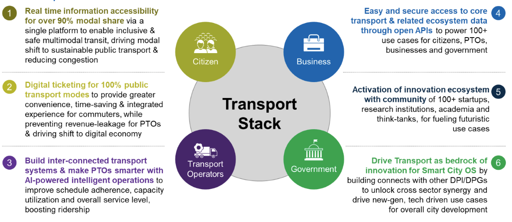
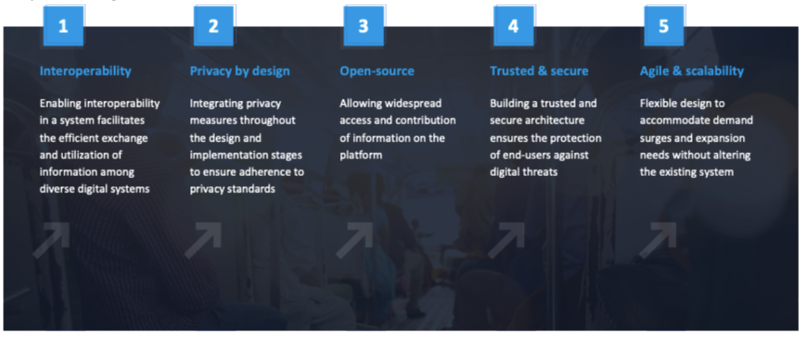

# About Transport Stack

In a world driven by technological advancement, the need for a positive vision on technology resonates loudly among government officials, technologists, businesses and donors. The consensus is clear: technology should strengthen societies by fostering innovation, human rights, inclusion and effective governance.

[Japan International Cooperation Agency (JICA)](https://www.jica.go.jp/english/) is chartered with promoting socio-economic growth in developing countries. JICA has played an instrumental role in redefining the mobility and infrastructure landscape by bringing metros to 17 cities across the world. Over the last few years with JICA DXLab (JICA's flagship initiative that spearheads digital transformation in its ODA programs) there is a pioneering focus on the development of Digital Public Infrastructure (DPI) and Digital Public Goods (DPGs) to achieve impact at population scale.

[JICA DXLab](https://www.jica.go.jp/english/about/dx/jicadx/dxlab/), headed by Mr. Yushi Nagano envisioned Transport Stack as an open, inclusive & innovative DPI designed to revolutionize mobility by building a multimodal ecosystem. Transport Stack aims to enable seamless data interoperability leveraging Standard Data Exchange Protocols, Data Hub Model and Mobility as a Service (MaaS) framework to offer a variety of use cases to ensure safe and secure transit, foster inclusive mobility, deeper penetration of digital services, and accelerate sustainable transport adoption.

JICA has collaborated with IIIT Delhi and its startup Chartr to set up the Transport Stack Open Innovation, aiming to drive transformative mobility solutions in transport ecosystem.

## Value Proposition

## Key Guiding Principles

By adhering to these foundational principles, Transport Stack not only promises a transformative impact on urban mobility but also establishes a robust framework to build trust in transport ecosystem for adoption. These principles hold together the success of Transport Stack, ensuring a resilient, adaptable, and secure foundation for redefining the way we navigate our cities.