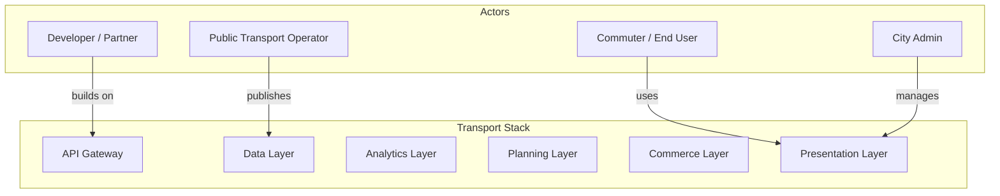
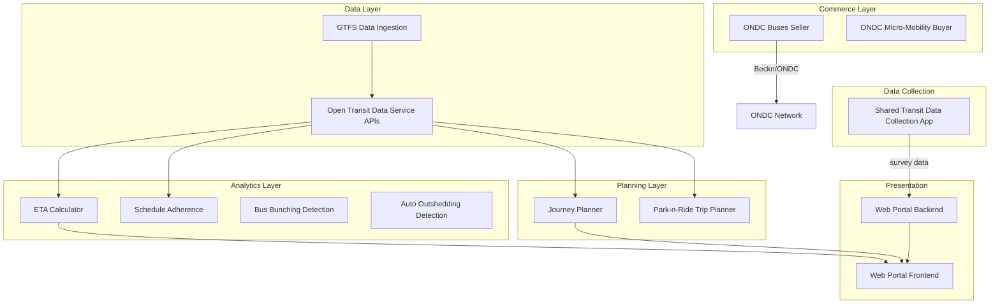
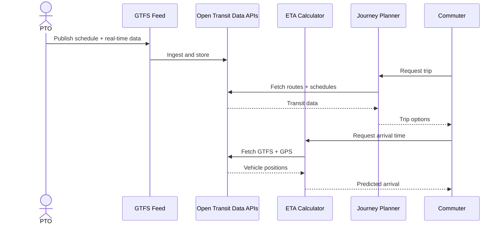
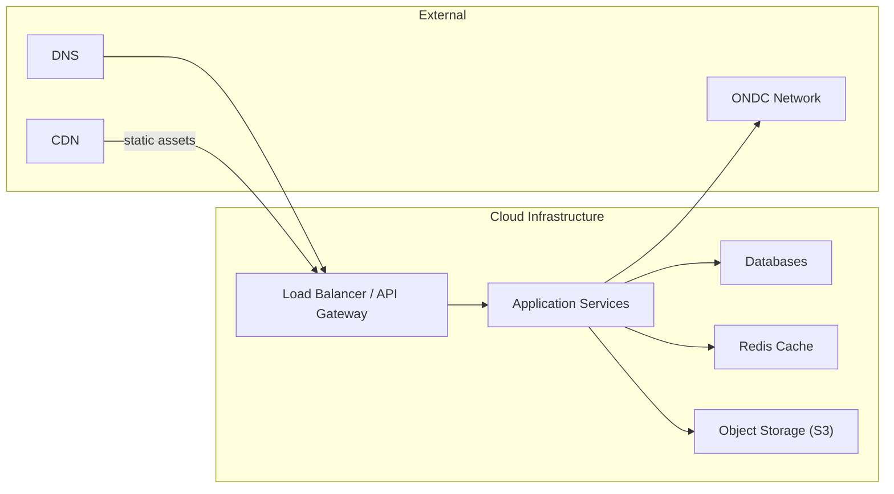

# Platform Architecture Overview

Transport Stack is a modular, API-first platform for building digital public infrastructure in urban mobility. This page describes its architecture at multiple levels of detail.

## Design Choices

The architecture emerged from specific constraints observed across Indian city deployments:

- **City-parameterized modules** — ETA Calculator, Journey Planner, and Schedule Adherence are structured by city (e.g., `/delhi/`, `/kochi/`). Each city gets its own GTFS feed, route data, and stops, but the same code serves them all. Adding a new city means adding data, not rewriting logic.
- **Environment-configured deployments** — API keys, database connections, cache endpoints, and monitoring (Elastic APM) are configured via environment variables and `.env` files, not hardcoded. The same code runs in dev and production.
- **Multi-framework backend** — different modules use different Python frameworks (Flask for ETA, Django for Open Transit Data APIs and Urban Transit Facilities, FastAPI for Auto Outshedding) based on each module's complexity and needs. A Spring Boot backend exists for the web portal layer. There is no single framework mandate.
- **Separated frontend and backend** — the Web Portal is a standalone React frontend consuming a separate Spring Boot backend, rather than server-rendered templates. This allows the frontend to be swapped or extended independently.
- **Protocol-based commerce layer** — ONDC Seller and Buyer modules use Beckn protocol for network-level interoperability rather than point-to-point API integrations. This is the only layer that depends on an external protocol standard.

## System Actors

### Actor Roles

| Actor | Role |
|-------|------|
| **Commuter / End User** | Uses journey planners, ETA predictions, ticketing apps, and ONDC-enabled mobility services |
| **Public Transport Operator (PTO)** | Publishes GTFS data, GPS feeds, and schedule information; uses analytics tools for performance monitoring |
| **City Admin** | Deploys and manages Transport Stack modules, administers the web portal, configures integration |
| **Developer / Partner** | Builds applications on top of Open Transit Data APIs, creates ONDC buyer/seller apps, extends existing modules |

## Functional Architecture

### Module Descriptions

| Module | Layer | Purpose |
|--------|-------|---------|
| **Open Transit Data Service APIs** | Data | Central API gateway for transit data (GTFS static + RT). Serves as the backbone for all downstream modules |
| **ETA Calculator** | Analytics | Real-time bus arrival predictions using GTFS schedule + GPS position |
| **Schedule Adherence** | Analytics | Compares actual vs scheduled arrival times; generates on-time performance metrics |
| **Bus Bunching Detection** | Analytics | Detects when buses on the same route run too close together |
| **Auto Outshedding Detection** | Analytics | Monitors bus depot exit/entry times; calculates distance traveled |
| **Journey Planner** | Planning | Multi-modal trip planning across available transit modes |
| **Park-n-Ride Trip Planner** | Planning | Trip planning with park-n-ride integration |
| **ONDC Buses Seller** | Commerce | Bus ticketing seller backend integrated with ONDC network |
| **ONDC Micro-Mobility Buyer** | Commerce | Buyer app for shared micro-mobility services on ONDC |
| **Web Portal Frontend** | Presentation | React-based web interface for Transport Stack |
| **Web Portal Backend** | Presentation | Spring Boot backend providing portal APIs |
| **Shared Transit Data Collection** | Data Collection | Android app for field data collection (metro stations, stops, routes) |
| **Urban Transit Facilities** | Management | Django-based web application for managing urban transit facilities and data |

## Modular Architecture: Data Flow

## Deployment View

- All services are designed for cloud deployment (AWS, Azure, or GCP)
- Each module can be deployed independently as a containerized service
- Redis is used for caching frequently accessed transit data
- GTFS data and static assets are stored in S3-compatible object storage
- API Gateway provides a single entry point for all client-facing services

## Modules Interconnection Summary

| Source Module | Consumes From | Protocol |
|--------------|---------------|----------|
| ETA Calculator | Open Transit Data APIs | REST / JSON |
| Journey Planner | Open Transit Data APIs | REST / JSON |
| Schedule Adherence | Open Transit Data APIs | REST / JSON |
| Park-n-Ride Planner | Open Transit Data APIs | REST / JSON |
| Web Portal Backend | All service modules | REST / JSON |
| ONDC Seller | PTO inventory + ONDC | Beckn protocol |
| ONDC Buyer | ONDC network | Beckn protocol |
