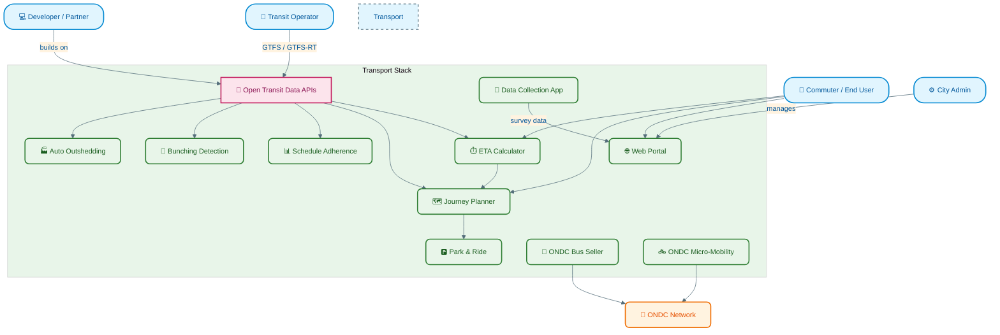
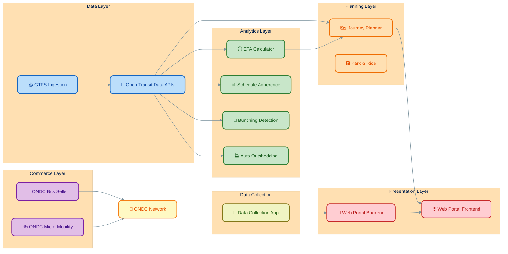
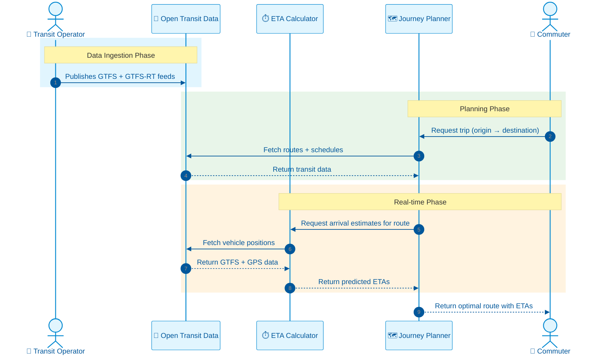
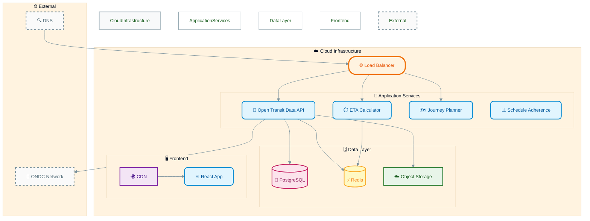

# Platform Architecture Overview

**Transport Stack** is a modular, API-first urban mobility platform designed as digital public infrastructure. Any city can fork, customize, and deploy the subset of modules it needs. This page describes the architecture at four levels: **design principles**, **system context**, **functional view**, and **deployment view**.

---

## Design Principles

| Principle | Rationale |
|-----------|-----------|
| **Modular & Composable** | Services deploy independently. A city can start with ETA and add Journey Planner later. |
| **City-Parameterized** | One codebase — each city's stops, routes, and schedules live in configuration, not code. Adding a city means adding data, not rewriting logic. |
| **Open Standards First** | GTFS, GBFS, and ONDC/Beckn protocols ensure interoperability with any third-party system. |
| **API-First** | Every module exposes a RESTful API. Frontends can be swapped or extended independently. |
| **Environment-Configured** | API keys, databases, caches, and monitoring are configured via environment variables. The same code runs in dev, staging, and production. |
| **Multi-Framework Backend** | Modules use the right framework for their complexity: Flask (ETA), Django (Data APIs), FastAPI (Outshedding), Spring Boot (Portal). No single framework mandate. |
| **Cloud-Native** | Containerized services deploy on any cloud (AWS, Azure, GCP) or on-premise. |

---

## System Context

```mermaid
%%{init: {'theme': 'base', 'themeVariables': { 'primaryColor': '#e1f5fe', 'primaryTextColor': '#01579b', 'primaryBorderColor': '#0288d1', 'lineColor': '#546e7a', 'secondaryColor': '#fff3e0', 'tertiaryColor': '#e8f5e9', 'fontFamily': 'Inter, sans-serif', 'fontSize': '14px' }}}%%
graph TB
    classDef actor fill:#e1f5fe,stroke:#0288d1,stroke-width:2px,color:#01579b,rx:20px,ry:20px
    classDef module fill:#e8f5e9,stroke:#2e7d32,stroke-width:2px,color:#1b5e20,rx:8px,ry:8px
    classDef external fill:#fff3e0,stroke:#ef6c00,stroke-width:2px,color:#e65100,rx:8px,ry:8px
    classDef data fill:#fce4ec,stroke:#c2185b,stroke-width:2px,color:#880e4f,shape:cylinder

    C["👤 Commuter / End User"]:::actor
    PTO["🏢 Transit Operator"]:::actor
    ADMIN["⚙️ City Admin"]:::actor
    DEV["💻 Developer / Partner"]:::actor

    subgraph "Transport Stack"
        style Transport Stack fill:#f8f9fa,stroke:#78909c,stroke-width:2px,stroke-dasharray: 5 5
        OTD["📡 Open Transit Data APIs"]:::data
        ETA["⏱️ ETA Calculator"]:::module
        JP["🗺️ Journey Planner"]:::module
        SA["📊 Schedule Adherence"]:::module
        BUN["🚌 Bunching Detection"]:::module
        AOS["🏭 Auto Outshedding"]:::module
        PR["🅿️ Park & Ride"]:::module
        ONDC_S["🎫 ONDC Bus Seller"]:::module
        ONDC_M["🚲 ONDC Micro-Mobility"]:::module
        PORTAL["🌐 Web Portal"]:::module
        COLLECT["📱 Data Collection App"]:::module
    end

    ONDC_NET["🔗 ONDC Network"]:::external

    PTO --"GTFS / GTFS-RT"--> OTD
    OTD --> ETA
    OTD --> JP
    OTD --> SA
    OTD --> BUN
    OTD --> AOS
    ETA --> JP
    JP --> PR
    C --> PORTAL
    C --> JP
    C --> ETA
    DEV --"builds on"--> OTD
    ADMIN --"manages"--> PORTAL
    COLLECT --"survey data"--> PORTAL
    ONDC_S --> ONDC_NET
    ONDC_M --> ONDC_NET
```

### Actor Roles

| Actor | Role |
|-------|------|
| **Commuter / End User** | Uses journey planners, ETA predictions, ticketing apps, and ONDC-enabled mobility services |
| **Transit Operator** | Publishes GTFS data and GPS feeds; uses analytics for performance monitoring |
| **City Admin** | Deploys and manages Transport Stack modules; configures city-specific settings |
| **Developer / Partner** | Builds applications on Open Transit Data APIs; creates ONDC buyer/seller apps |

---

## Functional Architecture

```mermaid
%%{init: {'theme': 'base', 'themeVariables': { 'primaryColor': '#bbdefb', 'primaryTextColor': '#0d47a1', 'primaryBorderColor': '#1976d2', 'lineColor': '#78909c', 'secondaryColor': '#c8e6c9', 'tertiaryColor': '#ffe0b2', 'quaternaryColor': '#e1bee7', 'fontFamily': 'Inter, sans-serif', 'fontSize': '13px' }}}%%
graph LR
    classDef data fill:#bbdefb,stroke:#1565c0,stroke-width:2px,color:#0d47a1,rx:8px,ry:8px
    classDef analytics fill:#c8e6c9,stroke:#2e7d32,stroke-width:2px,color:#1b5e20,rx:8px,ry:8px
    classDef planning fill:#ffe0b2,stroke:#ef6c00,stroke-width:2px,color:#e65100,rx:8px,ry:8px
    classDef commerce fill:#e1bee7,stroke:#7b1fa2,stroke-width:2px,color:#4a148c,rx:8px,ry:8px
    classDef presentation fill:#ffcdd2,stroke:#c62828,stroke-width:2px,color:#b71c1c,rx:8px,ry:8px
    classDef collection fill:#f0f4c3,stroke:#827717,stroke-width:2px,color:#33691e,rx:8px,ry:8px
    classDef external fill:#fff9c4,stroke:#f57f17,stroke-width:2px,color:#e65100,rx:8px,ry:8px

    subgraph "Data Layer"
        OTD["📡 Open Transit Data APIs"]:::data
        GTFS["📥 GTFS Ingestion"]:::data
    end

    subgraph "Analytics Layer"
        ETA["⏱️ ETA Calculator"]:::analytics
        SA["📊 Schedule Adherence"]:::analytics
        BB["🚌 Bunching Detection"]:::analytics
        AO["🏭 Auto Outshedding"]:::analytics
    end

    subgraph "Planning Layer"
        JP["🗺️ Journey Planner"]:::planning
        PNR["🅿️ Park & Ride"]:::planning
    end

    subgraph "Commerce Layer"
        ONDC_S["🎫 ONDC Bus Seller"]:::commerce
        ONDC_B["🚲 ONDC Micro-Mobility"]:::commerce
    end

    subgraph "Presentation Layer"
        PORTAL_FE["🌐 Web Portal Frontend"]:::presentation
        PORTAL_BE["🔌 Web Portal Backend"]:::presentation
    end

    subgraph "Data Collection"
        DC["📱 Data Collection App"]:::collection
    end

    ONDC_NET["🔗 ONDC Network"]:::external

    GTFS --> OTD
    OTD --> ETA
    OTD --> JP
    OTD --> SA
    OTD --> BB
    OTD --> AO
    ETA --> JP
    JP --> PORTAL_FE
    ONDC_S --> ONDC_NET
    ONDC_B --> ONDC_NET
    DC --> PORTAL_BE
    PORTAL_BE --> PORTAL_FE
```

### Module Descriptions

| Module | Layer | Purpose |
|--------|-------|---------|
| **Open Transit Data Service APIs** | Data | Central API gateway for transit data (GTFS static + real-time). Backbone for all downstream modules |
| **ETA Calculator** | Analytics | Real-time bus arrival predictions combining GTFS schedule + GPS positions |
| **Schedule Adherence** | Analytics | Compares actual vs scheduled times; generates on-time performance metrics |
| **Bus Bunching Detection** | Analytics | Detects when buses on the same route run too close together |
| **Auto Outshedding Detection** | Analytics | Tracks depot exit/entry times and distance traveled for fleet management |
| **Journey Planner** | Planning | Multi-modal trip planning (bus, metro, first/last mile) |
| **Park-n-Ride Trip Planner** | Planning | Trip planning integrating private vehicle + public transit |
| **ONDC Buses Seller** | Commerce | Bus ticketing seller backend integrated with the ONDC network |
| **ONDC Micro-Mobility Buyer** | Commerce | Buyer app for shared mobility services (bikes, autos, e-rickshaws) via ONDC |
| **Web Portal Frontend** | Presentation | React-based web interface for Transport Stack |
| **Web Portal Backend** | Presentation | Spring Boot backend providing portal APIs |
| **Data Collection App** | Data Collection | Android app for field data collection (stops, routes, station surveys) |
| **Urban Transit Facilities** | Management | Django web app for managing urban transit facilities and operational data |

---

## Data Flow Between Modules

```mermaid
%%{init: {'theme': 'base', 'themeVariables': { 'primaryColor': '#e1f5fe', 'primaryTextColor': '#01579b', 'primaryBorderColor': '#0288d1', 'lineColor': '#546e7a', 'secondaryColor': '#e8f5e9', 'tertiaryColor': '#fff3e0', 'fontFamily': 'Inter, sans-serif', 'fontSize': '14px' }}}%%
sequenceDiagram
    autonumber
    actor PTO as 🏢 Transit Operator
    participant OTD as 📡 Open Transit Data
    participant ETA as ⏱️ ETA Calculator
    participant JP as 🗺️ Journey Planner
    actor C as 👤 Commuter

    rect rgb(225, 245, 254)
        Note over PTO,OTD: Data Ingestion Phase
        PTO->>OTD: Publishes GTFS + GTFS-RT feeds
    end

    rect rgb(232, 245, 233)
        Note over C,JP: Planning Phase
        C->>JP: Request trip (origin → destination)
        JP->>OTD: Fetch routes + schedules
        OTD-->>JP: Return transit data
    end

    rect rgb(255, 243, 224)
        Note over C,ETA: Real-time Phase
        JP->>ETA: Request arrival estimates for route
        ETA->>OTD: Fetch vehicle positions
        OTD-->>ETA: Return GTFS + GPS data
        ETA-->>JP: Return predicted ETAs
    end

    JP-->>C: Return optimal route with ETAs
```

### Module Interconnection Summary

| Source Module | Consumes From | Protocol |
|--------------|---------------|----------|
| ETA Calculator | Open Transit Data APIs | REST / JSON |
| Journey Planner | Open Transit Data APIs | REST / JSON |
| Schedule Adherence | Open Transit Data APIs | REST / JSON |
| Park & Ride Planner | Open Transit Data APIs | REST / JSON |
| Web Portal Backend | All service modules | REST / JSON |
| ONDC Seller | PTO inventory + ONDC | Beckn protocol |
| ONDC Buyer | ONDC network | Beckn protocol |

---

## Deployment View

```mermaid
%%{init: {'theme': 'base', 'themeVariables': { 'primaryColor': '#e8f5e9', 'primaryTextColor': '#1b5e20', 'primaryBorderColor': '#2e7d32', 'lineColor': '#78909c', 'secondaryColor': '#e1f5fe', 'tertiaryColor': '#fff3e0', 'fontFamily': 'Inter, sans-serif', 'fontSize': '13px' }}}%%
graph TB
    classDef lb fill:#fff3e0,stroke:#ef6c00,stroke-width:3px,color:#e65100,rx:20px,ry:20px
    classDef app fill:#e1f5fe,stroke:#0288d1,stroke-width:2px,color:#01579b,rx:8px,ry:8px
    classDef db fill:#fce4ec,stroke:#c2185b,stroke-width:2px,color:#880e4f,shape:cylinder
    classDef cache fill:#fff9c4,stroke:#f9a825,stroke-width:2px,color:#f57f17,shape:cylinder
    classDef storage fill:#e8f5e9,stroke:#2e7d32,stroke-width:2px,color:#1b5e20,shape:cloud
    classDef cdn fill:#f3e5f5,stroke:#7b1fa2,stroke-width:2px,color:#4a148c
    classDef external fill:#fafafa,stroke:#78909c,stroke-width:2px,color:#546e7a,stroke-dasharray: 5 5

    subgraph "☁️ Cloud Infrastructure"
        style CloudInfrastructure fill:#f8f9fa,stroke:#b0bec5,stroke-width:2px
        LB["🌐 Load Balancer"]:::lb

        subgraph "🚀 Application Services"
            style ApplicationServices fill:#ffffff,stroke:#90a4ae,stroke-width:1px
            OTD["📡 Open Transit Data API"]:::app
            ETA["⏱️ ETA Calculator"]:::app
            JP["🗺️ Journey Planner"]:::app
            SA["📊 Schedule Adherence"]:::app
        end

        subgraph "🗄️ Data Layer"
            style DataLayer fill:#ffffff,stroke:#90a4ae,stroke-width:1px
            DB[(🐘 PostgreSQL)]:::db
            CACHE[(⚡ Redis)]:::cache
            S3[☁️ Object Storage]:::storage
        end

        subgraph "🖥️ Frontend"
            style Frontend fill:#ffffff,stroke:#90a4ae,stroke-width:1px
            CDN["🌍 CDN"]:::cdn
            UI["⚛️ React App"]:::app
        end
    end

    subgraph "🌐 External"
        style External fill:#fafafa,stroke:#78909c,stroke-width:2px,stroke-dasharray: 5 5
        DNS["🔍 DNS"]:::external
        ONDC["🔗 ONDC Network"]:::external
    end

    DNS --> LB
    LB --> OTD
    LB --> ETA
    LB --> JP
    OTD --> DB
    OTD --> CACHE
    OTD --> S3
    ETA --> CACHE
    CDN --> UI
    OTD --> ONDC
```

### Deployment Topology

| Component | Technology | Scalability |
|-----------|-----------|-------------|
| API Gateway | nginx / cloud LB | Horizontally scalable |
| Open Transit Data APIs | Python (Django) + Gunicorn | Per-service |
| ETA Calculator | Python (Flask) | Per-service |
| Journey Planner | Python (Django) | Per-service |
| Web Portal Frontend | React, served via nginx | CDN + horizontal |
| Web Portal Backend | Java (Spring Boot) | Per-service |
| Databases | PostgreSQL, SQLite | Read replicas |
| Cache | Redis | In-memory cluster |
| Message Broker | Redis / Celery | Async workers |
| CI/CD | GitHub Actions | Free for OSS |
| Object Storage | AWS S3 (or compatible) | Unlimited |

---

## Repository Map

| Repository | Module | Language | Framework |
|-----------|--------|----------|-----------|
| `open-transit-data-service-apis` | Open Transit Data APIs | Python | Django + DRF |
| `eta-calculator` | ETA Calculator | Python | Flask |
| `journey-planner` | Journey Planner | Python | Django |
| `schedule-adherence` | Schedule Adherence | Python | — |
| `bus-bunching-detection` | Bus Bunching Detection | Python | — |
| `buses-auto-outshedding` | Auto Outshedding | Python | FastAPI |
| `park-n-ride-trip-planner` | Park & Ride Trip Planner | Python | Django |
| `ondc-buses-seller` | ONDC Bus Ticketing Seller | Python | Django |
| `ondc-micro-mobility-buyer` | ONDC Micro-Mobility Buyer | Python | Django |
| `transport-stack-web-portal-backend` | Web Portal Backend | Java | Spring Boot |
| `transport-stack-web-portal-frontend` | Web Portal Frontend | JavaScript | React |
| `urban-transit-facilities` | Urban Transit Facilities | JavaScript | Node.js / Django |
| `shared-transit-data-collection-app` | Data Collection App | Java | Android |
| `wiki-transport-stack` | Documentation Wiki | JavaScript | Docusaurus |
