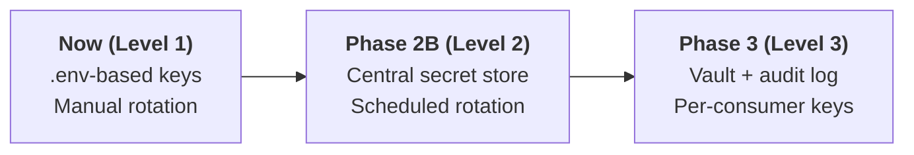

# Security & Privacy Architecture

How Transport Stack approaches security, privacy, and secrets management — its governing principles, what's enforced today, and where the model is headed. Inspired by MOSIP's published Privacy & Security architecture for public digital infrastructure.

:::info Status
This is a v1.0 statement of direction. Where a control is described as **planned**, it has an intake item in the custodianship roadmap; see the [Technology Stack](/docs/architecture/tech-stack) page for the underlying tools.
:::

---

## Security by Design

### Governing Principles

| # | Principle | What it means for Transport Stack |
|---|-----------|-----------------------------------|
| 1 | **Non-personal data first** | All GTFS/GTFS-RT feeds, schedules, and ridership aggregates are public-domain, non-personal data. No personally identifiable information is collected by default. |
| 2 | **Least privilege** | API clients receive scoped API keys; deployments limit S3 and database access per service. |
| 3 | **Security by contract** | Security claims live in the API contract (OpenAPI/Swagger), not in informal README text. |
| 4 | **Defense in depth** | Perimeter authentication (API keys) + application authorization (RBAC) + operational controls (secrets, monitoring). |
| 5 | **No secrets in code** | Credentials live in environment variables / `.env` files only; never committed to repositories. |
| 6 | **Disclosure-ready** | A public `[SECURITY.md](https://github.com/transport-stack/.github)` policy describes how to report vulnerabilities. |

### Internal Practices

Development- and release-time controls, applied uniformly across the org's repos:

| Practice | Tooling | Status |
|----------|---------|--------|
| Dependency updates | Dependabot (`pip`/`npm`/`gradle` + `github-actions` ecosystems), weekly, org-wide | ✅ Production |
| PR / commit hygiene | `danger.yml` + `commit-check.yml` on every PR | ✅ Production |
| Vulnerability disclosure | Org-level [`SECURITY.md`](https://github.com/transport-stack/.github) | ✅ Production |
| Static analysis (SAST) | None yet — CodeQL vs. CodeRabbit under evaluation | 🔲 Planned |
| Dynamic analysis (DAST) | None yet | 🔲 Planned |
| Release signing | None yet | 🔲 Planned |

### Operational Practices

#### 1. Authentication

##### API Key-Based Authentication (Standard)

Every module that exposes public data APIs expects an **`X-API-KEY`** header. This is the same pattern used uniformly across the platform's Django and Flask services.

| Module | Header | Enforcement | Status |
|--------|--------|-------------|--------|
| Open Transit Data APIs | `X-API-KEY` | Middleware on protected endpoints; Swagger UI openly readable | Production |
| Journey Planner | `.env`-based middleware (`env_middlewares`) | Per-route | Production |
| ETA Calculator | `X-API-KEY` (Flask) | Configured per deployment | Production |
| Web Portal Backend | Spring Security filter | Application-level | Production |

**Key issuance policy:**

- Keys are issued by the custodian to named integrators (PTOs, app developers). Each key is attributable to an organization.
- Keys are rotated on a schedule and on suspected compromise.
- Keys transmitted only in the request **header**, never in URLs (avoids leaking keys into logs).

#### 2. Authorization (RBAC)

Role-based access is enforced in the application tier, not exposed in data APIs:

| Layer | Roles | Where |
|-------|-------|-------|
| **Web Portal** | `admin`, `operator`, `viewer` | Django models + session auth |
| **OTD / S3 data** | Read-scoped bucket policies per city feed | AWS IAM |
| **Wiki & docs** | Public read, restricted write | GitHub org roles |
| **Database** | Service-account users with narrow grants | PostgreSQL |

#### 3. Rate Limiting

| Policy | Where | Status |
|--------|-------|--------|
| Default request throttling on public APIs | Django REST Framework settings | Production (standardized on Open Transit Data APIs) |
| Per-key rate caps for integrators | Roadmap — Phase 2B | 🔲 Planned |
| Public docs/wiki | Served by Docusaurus (static) behind CDN | Production |

#### 4. Cryptography

| Layer | Mechanism |
|-------|-----------|
| **In transit** | TLS 1.2+ enforced at the load balancer / Amplify level for all web traffic. API payloads travel over HTTPS only. |
| **At rest** | AWS S3 server-side encryption (AES-256) for static data files; PostgreSQL volumes encrypted via AWS EBS/KMS. |
| **Secrets** | `.env` per service, never committed. Deployment environments (EKS, Docker Compose) inject credentials via managed secrets. |

#### 5. Key & Secrets Management

Current maturity is **Level 1: Manual rotation via environment variables**. The roadmap elevates this:

> All public repositories must never contain keys. The org-level security policy ([`SECURITY.md`](https://github.com/transport-stack/.github)) defines the disclosure path if one is accidentally committed.

#### 6. Audit & Observability

- All API requests carry a request ID; keys are logged (hashed) with timestamps for abuse analysis.
- Custodianship run reports (quarterly) include a security review section covering key issuance, incidents, and disclosures.

---

## Privacy by Intent

Transport Stack's equivalent of minimal-data-collection is structural: it's a **public, non-personal data** platform by design, not one that collects PII and restricts access to it.

| Question | Answer |
|----------|--------|
| Does the platform collect personal data? | **No** — all data published (GTFS, schedules, trip counts) is non-personal. |
| What if PII accidentally lands in a feed? | Curation policy: strip on ingress, with notification to the source PTO. |
| How is user feedback handled? | Roundtable/contact forms are processed only by named custodians, not logged in platform databases. |
| Minimal disclosure equivalent | Consumers only ever receive the fields defined in each module's public API contract — no internal/ops fields are exposed. |

---

## See Also

- [Platform Architecture Overview](/docs/architecture/overview)
- [Technology Stack](/docs/architecture/tech-stack)
- [SECURITY.md on GitHub](https://github.com/transport-stack/.github)

---

*Maturity statement applies to Transport Stack v1.0 · Updated Aug 2026*
