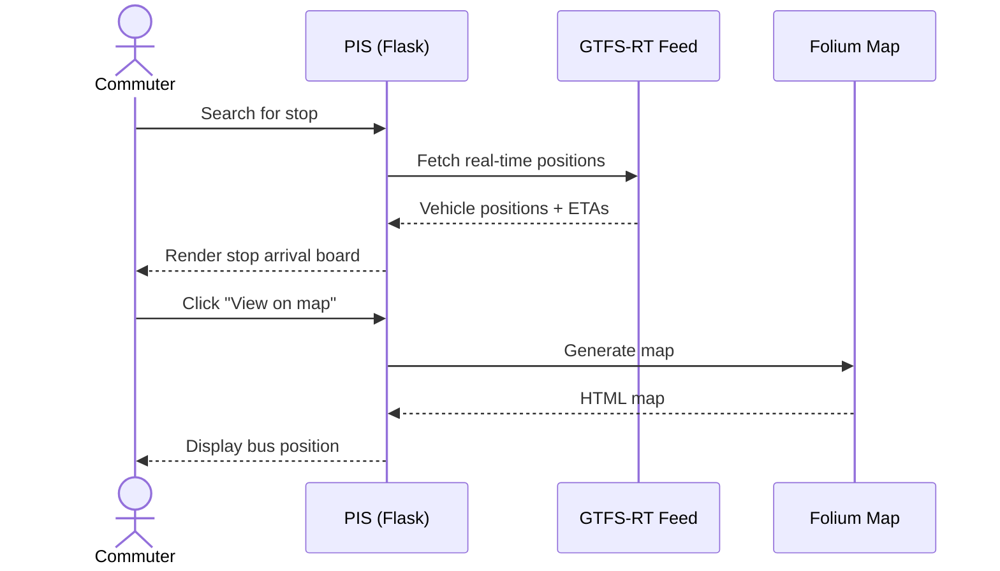

# ETA Calculator (PIS) — UI/UX Specification

Module-level UI/UX specification for the Transport Stack ETA Calculator and Passenger Information System (PIS).

| Attribute | Value |
|-----------|-------|
| **Repo** | [`eta-calculator`](https://github.com/transport-stack/eta-calculator) |
| **Stack** | Python 3.7+ · Flask · Bootstrap 4.4 |
| **Service page** | [ETA Calculator for Buses](https://delhi.transportstack.in/data-services/servicedetails/1) |
| **Status** | ✅ Production |
| **Spec version** | v1.0 (Aug 2026) |

---

## 1. Overview

The ETA Calculator serves two purposes:

- **Passenger Information System (PIS)**: A web UI for commuters to check real-time bus arrivals at stops, view bus positions on a map, and browse all available routes.
- **REST API**: JSON endpoints for third-party apps to query bus ETAs, nearby stops, and route data.

The service is deployed per-city with URL prefixes (e.g., `/delhi/`, `/kochi/`) and uses GTFS-RT feeds for real-time vehicle positions.

---

## 2. Screens

### 2.1 Home Page

**Route:** `/`

A search interface for finding stops by name. The page features:

- **Jumbotron header** with the Transport Stack logo and title "Delhi Buses Stop | Public Information Systems (PIS)"
- **Autocomplete search input** — users type a stop name and see matching stops as they type
- **Bootstrap 4 responsive layout** — centered column on desktop, full-width on mobile


The autocomplete fetches stop suggestions as the user types, allowing quick navigation to a stop's arrival board.

### 2.2 Stop Arrival Board (PIS Page)

**Route:** `/delhi/<stop-name-slug>` · `/get_buses_arriving_at_stop?stopid=<stop-id>`

Displays real-time bus arrivals at a specific stop. The page shows:

- **Stop name** at the top (e.g., "ITO Ring Road")
- **List of upcoming buses** with route names, destination, and estimated time of arrival (ETA)
- **Highlighted card** showing the stop name and current time
- **Auto-refresh** to keep the data current


Each bus entry includes the route number (e.g., "522CL"), destination, and minutes until arrival. An orange banner may indicate the data source status (e.g., "Currently showing cluster buses only. More buses coming soon!").

### 2.3 All Stops List

**Route:** `/all_rt_buses`

A browsable list of all stops in the system. Useful for discovering available stops when the user doesn't know the exact name.

### 2.4 Bus Position Map

**Route:** `/plot_buses?stop_id=<id>&vehicle_id=<id>&route=<route>`

A **folium-generated map** showing a specific bus's real-time position on its route. The map includes:

- Marker for the bus's current location
- Route polyline
- Stop markers along the route

### 2.5 All Buses on a Route

**Route:** `/get_buses_on_route?route_long_name=<name>`

Lists all buses currently operating on a given route, with their positions and ETAs.

---

## 3. REST API Endpoints

### 3.1 v1 Endpoints

| Endpoint | Method | Description |
|----------|--------|-------------|
| `/` | GET | Home page (HTML) |
| `/all_rt_buses` | GET | List all stops |
| `/get_buses_arriving_at_stop?stop_id=<id>` | GET | Buses arriving at a stop (HTML page) |
| `/get_bus_data_new` | GET | Raw bus data (JSON) |
| `/all_rt_buses_data` | GET | All buses data (JSON) |
| `/get_buses_on_route?route_long_name=<name>` | GET | Buses on a route (JSON) |
| `/plot_buses?stop_id=<id>&vehicle_id=<id>&route=<name>` | GET | Map view (HTML) |

### 3.2 v2 Endpoints

Mounted at `/v2/` prefix:

| Endpoint | Method | Description |
|----------|--------|-------------|
| `/v2/get_stops_near_to_location?coordinates=<lat,lon>` | GET | Nearby stops given coordinates |
| `/v2/get_buses_on_route_with_eta?route_long_name=<name>` | GET | Buses on a route with ETA |
| `/v2/get_buses_next_stop_eta` | GET | All buses with next-stop ETAs |

### 3.3 Delhi PIS Endpoints

Mounted at `/delhi/` prefix:

| Endpoint | Method | Description |
|----------|--------|-------------|
| `/delhi/<stop-name-slug>` | GET | PIS page for a stop (by name slug) |
| `/delhi/s/<stop-id>` | GET | Redirect to stop by ID |

---

## 4. Sample JSON Responses

### `/v2/get_stops_near_to_location`

**Request:**
```
GET /v2/get_stops_near_to_location?coordinates=[28.5672, 77.2100]
```

**Response:**
```json
[
  {
    "stop_id": 1234,
    "stop_name": "AIIMS",
    "stop_lat": 28.5672,
    "stop_lon": 77.2100,
    "distance_m": 45
  }
]
```

### `/v2/get_buses_on_route_with_eta`

**Request:**
```
GET /v2/get_buses_on_route_with_eta?route_long_name=723
```

**Response:**
```json
[
  {
    "vehicle_id": "DL1PC1234",
    "route_long_name": "723",
    "trip_id": "723_001",
    "current_stop_id": 5678,
    "next_stop_id": 5679,
    "eta_seconds": 180,
    "timestamp": "2026-08-13T10:30:00Z"
  }
]
```

---

## 5. Process Flow



---

## 6. City Parameterization

The service supports multiple cities via URL prefixes:

- `/delhi/` — Delhi bus network

Each city has its own GTFS feed and stop database. The Flask app routes city-specific views and APIs under the prefix.

---

## 7. Auth Gap

**Current:** No API key required for v1 or v2 endpoints.

**Recommendation (per [Security & Privacy](/docs/architecture/security-privacy)):** Add `X-API-KEY` header authentication to v2 endpoints, consistent with the platform's standard auth model.

---

*Spec v1.0 · Updated Aug 2026*
