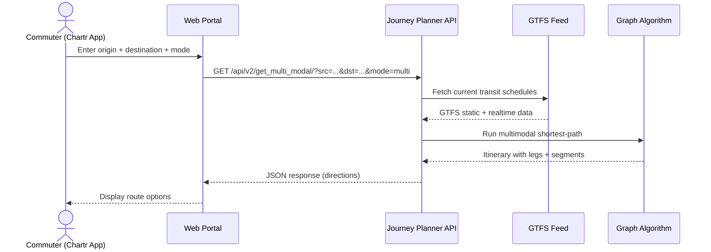

# Journey Planner — UI/UX Specification

Module-level UI/UX specification for the Transport Stack Multimodal Journey Planner.

| Attribute | Value |
|-----------|-------|
| **Repo** | [`journey-planner`](https://github.com/transport-stack/journey-planner) |
| **Stack** | Python 3.10 · Django 5.0.2 · DRF 3.15 · drf-spectacular |
| **Service page** | [Multimodal Journey Planner](https://delhi.transportstack.in/data-services/servicedetails/2) |
| **Consumer UI** | Chartr commuter app |
| **Status** | ✅ Production |
| **Spec version** | v1.0 (Aug 2026) |

---

## 1. Overview

The Journey Planner is a REST API service that computes multimodal travel itineraries across Delhi's transit network. It combines:

- **Bus routes** (DTC, DoT, cluster buses)
- **Metro lines** (DMRC)
- **First/last-mile** modes (bike, auto-rickshaw, park-and-ride)

The service is consumed by the **Chartr commuter app** and the **Transport Stack Web Portal** — it has no standalone UI of its own.

---

## 2. Consumer UI

The Journey Planner's results are surfaced in:

- **Chartr commuter app** (Android/iOS) — primary consumer, shows route options to daily commuters
- **Transport Stack Web Portal** — `delhi.transportstack.in` data-services catalogue

The planner itself exposes only JSON APIs and an auto-generated Swagger documentation page.

---

## 3. REST API Endpoints

### 3.1 v2 Endpoints

| Endpoint | Method | Auth | Description |
|----------|--------|------|-------------|
| `/api/v2/get_multi_modal/` | GET | `x-api-key` header | Compute multimodal itinerary |
| `/api/v2/get_stops/` | GET | `x-api-key` header | List stops by transit mode |

### 3.2 OpenAPI Schema

Auto-generated Swagger UI is available at `/schema/` for API exploration and client code generation.


---

## 4. Request Parameters

### `/api/v2/get_multi_modal/`

| Parameter | Type | Required | Description |
|-----------|------|----------|-------------|
| `src` | string | ✅ | Origin location (coordinates or stop ID) |
| `src_type` | string | ✅ | Origin type: `place`, `metro`, or `bus` |
| `dst` | string | ✅ | Destination location (coordinates or stop ID) |
| `dst_type` | string | ✅ | Destination type: `place`, `metro`, or `bus` |
| `mode` | string | ✅ | Transit mode (see table below) |
| `time` | string | ❌ | Departure time (`HH:MM:SS` or `HH:MM:SS AM/PM`) |
| `x-api-key` | header | ✅ | API key for authentication |

### Transit Modes

| Mode | Description |
|------|-------------|
| `bus` | Bus-only routes |
| `metro` | Metro-only routes |
| `multi` | Combined bus + metro |
| `bike` | First/last-mile by bike |
| `auto` | First/last-mile by auto-rickshaw |
| `ptx` | Park-and-ride + transit |
| `ptx,bus` | Park-and-ride + bus |
| `ptx,metro` | Park-and-ride + metro |

### `/api/v2/get_stops/`

| Parameter | Type | Required | Description |
|-----------|------|----------|-------------|
| `mode` | string | ❌ | Filter: `bus`, `metro`, or `multi` |
| `x-api-key` | header | ✅ | API key for authentication |

---

## 5. Sample Requests

The README documents eight example mode combinations:

```
# 1. Bus route between two places
GET /api/v2/get_multi_modal/?src=[28.7041,77.1025]&src_type=place&dst=28.7041,77.1025&dst_type=place&mode=bus

# 2. Metro between two stations
GET /api/v2/get_multi_modal/?src=44&src_type=metro&dst=101&dst_type=metro&mode=metro&time=12:00:00

# 3. Multimodal (bus + metro combined)
GET /api/v2/get_multi_modal/?src=44&src_type=metro&dst=101&dst_type=metro&mode=multi&time=12:00:00

# 4. Park-and-ride + metro
GET /api/v2/get_multi_modal/?src=44&src_type=metro&dst=101&dst_type=metro&mode=ptx,metro&time=12:00:00

# 5. Park-and-ride + bus
GET /api/v2/get_multi_modal/?src=44&src_type=metro&dst=101&dst_type=metro&mode=ptx,bus&time=12:00:00

# 6. Bike first/last mile
GET /api/v2/get_multi_modal/?src=44&src_type=metro&dst=101&dst_type=metro&mode=bike&time=12:00:00

# 7. Auto-rickshaw first/last mile
GET /api/v2/get_multi_modal/?src=44&src_type=metro&dst=101&dst_type=metro&mode=auto&time=12:00:00

# 8. Park-and-ride (transit unspecified)
GET /api/v2/get_multi_modal/?src=44&src_type=metro&dst=101&dst_type=metro&mode=ptx&time=12:00:00
```

---

## 6. Sample Response

A successful itinerary response includes one or more possible directions, each with legs and segments:

```json
{
  "message": "Success.",
  "description": "Found 2 possible directions.",
  "possible_directions": [
    {
      "total_distance_km": 12.4,
      "total_time_min": 38,
      "total_fare_inr": 25,
      "legs": [
        {
          "mode": "walk",
          "distance_km": 0.3,
          "time_min": 4,
          "from": "Your location",
          "to": "AIIMS Metro Station"
        },
        {
          "mode": "metro",
          "distance_km": 8.1,
          "time_min": 22,
          "from": "AIIMS",
          "to": "Rajiv Chowk",
          "line": "Yellow Line",
          "fare_inr": 20
        },
        {
          "mode": "bus",
          "distance_km": 4.0,
          "time_min": 12,
          "from": "Rajiv Chowk Bus Stop",
          "to": "Nehru Place",
          "route": "723",
          "fare_inr": 5
        }
      ]
    }
  ]
}
```

### Error Response

When validation fails (e.g., missing required parameter):

```json
{
  "message": "Failure.",
  "description": "src: This field is required. | mode: Invalid mode selected.",
  "possible_directions": []
}
```

---

## 7. Process Flow



---

## 8. Authentication

API key authentication via the `x-api-key` HTTP header. Keys are issued by the custodian to named integrators (PTOs, app developers). The API key decorator (`@check_api_key_decorator`) enforces this on all endpoints.

See [Security & Privacy](/docs/architecture/security-privacy) for the platform's auth model.

---

## 9. See Also

- [Technology Stack](/docs/architecture/tech-stack)
- [Security & Privacy](/docs/architecture/security-privacy)
- [ETA Calculator](/docs/ui-specs/eta-calculator)

---

*Spec v1.0 · Updated Aug 2026*
