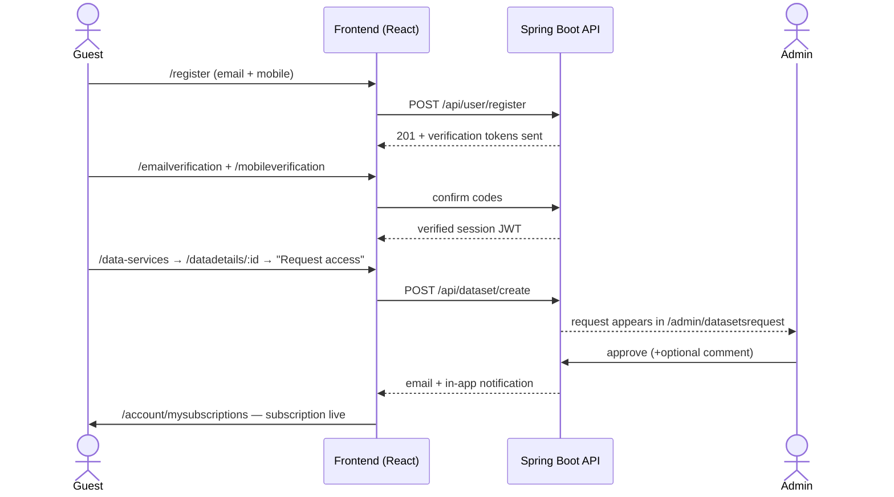
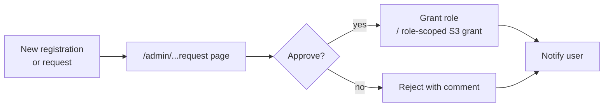
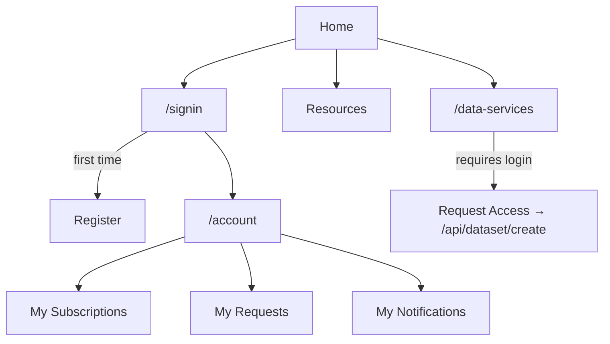

# Web Portal — UI/UX Specification

Module-level UI/UX specification for the Transport Stack Web Portal, modeled on MOSIP's per-module documentation style (process flows, screen inventories, sample payloads). This is the **reference module**: other module specs (ETA Calculator, Journey Planner) use the same structure.

| Attribute | Value |
|-----------|-------|
| **Repos** | [`transport-stack-web-portal-frontend`](https://github.com/transport-stack/transport-stack-web-portal-frontend) · [`transport-stack-web-portal-backend`](https://github.com/transport-stack/transport-stack-web-portal-backend) |
| **Frontend stack** | React 18.3.1 · Redux · Bootstrap |
| **Backend stack** | Spring Boot 3.3.1 (Java 17) |
| **Auth model** | JWT session; per-role protected routes |
| **Status** | ✅ Production |
| **Spec version** | v1.0 (Aug 2026) |

---

## 1. Roles

| Role | Sees | Route guard |
|------|------|-------------|
| **Guest** | Public marketing/content pages, catalogue browse, registration | none |
| **User** | Account dashboard, subscriptions, requests, notifications | `ProtectedRoute` |
| **Admin** | User management, dataset/service request approval, admin management | `ProtectedAdminRoute` |

## 2. Screen Inventory

### Public (no auth)

| Route | Page | Purpose |
|-------|------|---------|
| `/` | Home | Landing; aggregates the innovation pitch |
| `/aboutus` | About Us | Custodians + partners |
| `/resources` … | Resources hub + 5 subsections | User support, marketing, boarding policy, tech resource, misc |
| `/innovationchallenge` | Innovation Challenge | Challenge info & CTA |
| `/howtojoin` | How to Join | Onboarding path for new PTOs \\
| `/media` | Media | Press/clips |
| `/data-services` → `/datadetails/:id` · `/servicedetails/:id` | Data + Service catalogue | Browse + drill-in |
| `/cookiepolicy`, `/privacypolicy`, `/termsofuse` | Legal | Compliance |
| `/help-support` | Help & Support | FAQ + contact |

### User (after login)

| Route | Page | Primary actions |
|-------|------|-----------------|
| `/account/mysubscriptions` | My Subscriptions | List live subscriptions |
| `/account/myrequests` | My Requests | Track status of dataset requests |
| `/account/myprofile` | My Profile | Edit profile |
| `/account/settings` | Settings | Notification prefs, language |
| `/account/mynotifications` | Notifications | Read/act on events |

### Admin

| Route | Page | Actions |
|-------|------|---------|
| `/admin/usermanagement` (`view/add/edit`) | User Management | List, onboard, suspend users |
| `/admin/datasetsrequest` (`details`) | Dataset Request Mgmt | Approve/deny with comment |
| `/admin/registrationrequest` | Registration Request Mgmt | Approve/reject new registrations |
| `/admin/adminmanagement` | Admin Management | Manage admin roles |

## 3. Core Process Flows

### 3.1 Registration → First Subscription



### 3.2 Admin Approvals



## 4. Sample JSONs

### `POST /api/user/register` — request body

```json
{
  "email": "user@example.com",
  "mobile": "+91xxxxxxxxxx",
  "name": "Anita",
  "organization": "ACME Mobility"
}
```

### `POST /api/dataset/create` — request body

```json
{
  "datasetId": "DEL-PMTS-BUSES-RT",
  "reason": "Building an analytics layer for Delhi bus arrivals",
  "agreedTerms": true
}
```

### `GET /api/dataset/list` — response, curated

```json
{
  "items": [
    {
      "id": "DEL-PMTS-BUSES-RT",
      "name": "Delhi PMTS bus positions",
      "city": "Delhi",
      "format": "GTFS-RT",
      "freshnessSec": 30,
      "category": "vehicle-positions"
    }
  ]
}
```

## 5. Navigation & IA



## 6. Design Tokens

| Token | Value | Source |
|-------|-------|--------|
| Base font | System / Bootstrap default | frontend theme |
| Color palette | Brand indigo/purple accents on neutral | `index.css` |
| Layout | Container + 12-col Bootstrap grid | CRA scaffolding |
| Component library | Bootstrap + Crispy Forms | `package.json` |

## 7. Accessibility & i18n

- Minimum contrast target: WCAG 2.1 AA
- All forms have `<label>` for each input
- Keyboard navigation through navbar and dialog focus trap
- Language: English first; Hindi underway on content pages (not yet wired into routing)

## 8. Outstanding and Roadmap

| # | Item | Owner | Target |
|---|------|-------|--------|
| 1 | Hindi routing + full content translation | Web Portal | Q3 |
| 2 | Townhall-enabled dataset approval webhooks | Admin | Q3 |
| 3 | Public availability of /servicedetails offline dumps | Data Team | Q4 |

---

### Template adoption
> Future module specs reuse this skeleton: roles → screen inventory → process flows (sequence + decision) → sample JSONs → navigation model → design tokens → a11y → roadmap.
