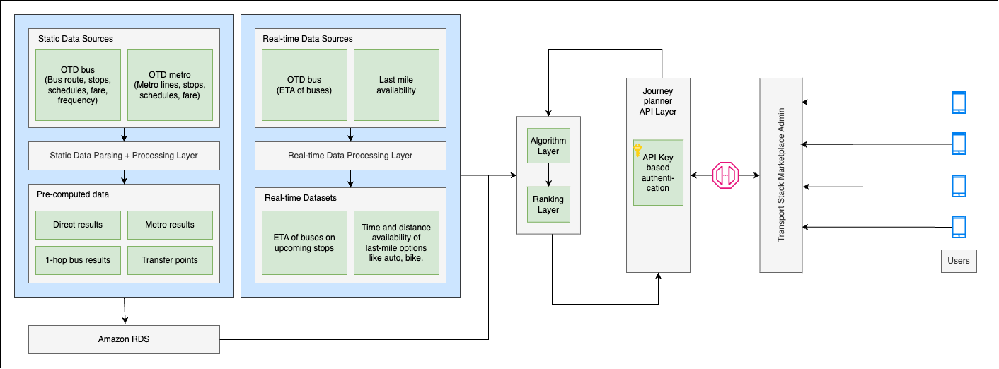

# Journey Planner

## Introduction

Journey Planner is used for planning commuter’s journey from one place to another.  
It aims to enhance the commuting experience by offering detailed, real-time information and optimizing travel routes using various public transportation modes like buses, metro or both.

## Why Build a Journey Planner Service?

Modern urban regions offer multiple public transport modes (buses, metro, first/last mile options), making trip planning complex. A journey planner enhances the commuting experience by:

- **Empowering Users**: Provides optimal, real-time route options across all available modes.  
- **Personalization**: Considers user preferences for time, cost, accessibility, and convenience.  
- **Reliability**: Utilizes open standards like GTFS and live vehicle tracking for accurate results.  
- **Scalability**: Designed to serve large metropolitan areas with high user concurrency.  
- **Ecosystem Integration**: Enables apps, web platforms, kiosks, and physical displays to offer consistent trip planning services.

## Core Functional Capabilities for Multimodal Trip Planning

The following table outlines the key functional features supported across different transport modes for seamless trip planning.

| Feature                 | Bus | Metro | Multi-modal |
|------------------------|-----|-------|-------------|
| Real-time direct trips | ✔   | ✔     | ✔           |
| Real-time with transfer| ✔   | ✖     | ✔           |
| Scheduled trips        | ✔   | ✔     | ✔           |
| ETAs shown             | ✔   | ✔     | ✔           |
| Multiple suggestions   | ✔   | ✔     | ✔           |

**Additional Enhancements:**

- **Walkability & Accessibility**: Ranks stops by proximity (default: 300m) and step-free access availability.  
- **Amenities Metadata**: Provides details on gates, lifts, and parking at key stations (where available).  
- **Personalization**: Offers filters based on time, cost, and route complexity in terms of number of interchanges for tailored planning.

## System Overview

The service integrates multiple datasets, computes optimal journeys, and exposes results through scalable APIs.

### Data Layer

- **Static Data**: Includes stops, routes, schedules, stop sequences, and fare information. Grouping of nearby stops (via "walk edges") is used to enable better multimodal connectivity.  
- **Real-Time Data**: Live vehicle positions and ETAs, allowing dynamic updates for delay, disruption, and vehicle arrival information.  
- **Dynamic Data**: Covers first/last mile mode availability (e.g., bike, auto, rideshare) and estimated pickup times.

### Data Processing Layer

- **Data Cleaning**: Removes duplicate stops, clusters nearby stops, and generates logical walk edges.  
- **Graph Conversion**: Transforms transit data into a graph model for algorithmic routing.  
- **Real-Time Integration**: Merges live feeds with static schedules to compute timely and accurate trip suggestions.  
- **Filtering & Ranking**: Applies business logic to prioritize routes by real-time reliability, convenience, and user preferences.

### Pre-Computation Layer

- Pre-computes popular origin-destination pairs, journey times, transfer metadata, and fare details.  
- Periodically refreshed when static data updates occur.  
- Ensures lower latency and higher system throughput during peak hours.

### Storage Layer

- Uses a relational database with tightly coupled schema aligned with the routing engine.  
- Precomputed results are indexed for fast lookup and API delivery.

  

## Journey Planner Algorithm

The system leverages advanced algorithms to provide optimal and user-friendly trip recommendations across modes.

### Route Planning Highlights

- Determines the most efficient routes using a blend of static schedules and real-time data feeds.  
- Enables seamless multimodal navigation across different transportation services.  
- Minimizes user inconvenience by discouraging excessive transfers and long walking segments.  
- Prioritizes routes that are direct, time-efficient, and reflect current traffic or service conditions.

### Filtering and Ranking

- **Filters routes based on**:  
  - Schedule availability  
  - Transfer limits  
  - Fare constraints  
  - User-selected modes  
- **Ranks options by**:  
  - Real-time availability  
  - Travel time  
  - Frequency  
  - Comfort and accessibility

## Optimization Model

The journey planner employs an optimization model to deliver efficient, practical, and reliable travel options using a weighted cost function.

### Cost Function Components

- **Travel Time**: Sum of segment times between stops.  
- **Waiting Time**: Real-time vehicle arrival delays at origin points.  
- **Transfer Penalty**:  
  - Higher penalty for walking to another stop.  
  - Lower penalty for same-stop transfers.  
- **Walk Edge Constraints**: Routes with two consecutive walk segments are discarded.

### Optimization Pipeline

- **Input Mapping**: Maps user's source and destination to nearest valid stops.  
- **Shortest Path Computation**: Runs routing algorithm for each valid pair.  
- **Result Scoring**: Applies filtering and ranking logic.  
- **User Presentation**: Curated journey options are returned to the interface or API client.

### Error Handling

| Scenario                          | Status   | Message             |
|----------------------------------|----------|----------------------|
| Missing input                    | Failed   | "parameter missing"  |
| Invalid stop ID or mode type     | Failed   | "invalid parameter"  |
| Coordinates outside service area | Failed   | "no result found"    |
| Incorrect time format            | Failed   | "invalid parameter"  |

## API Endpoints

- **API Gateway**: Handles request management, security, rate limiting, and analytics.  
- **Public APIs**:  
  - `/api/get_stops?mode=<bus|metro|multi-modal>`  
  - `/api/<version>/get_multi_modal/?<args>`

### 1. Get Stops

- **Endpoint**: `/api/get_stops?<args>`  
- **Method**: GET  
- **Arguments**:  
  - `mode`: `bus`, `metro`, or `multi-modal`  
- **Example**:  
  `/api/get_stops?mode=bus`

### 2. Get Multi-Modal Journey

- **Endpoint**: `/api/<version>/get_multi_modal/?<args>`  
- **Method**: GET  
- **Required Arguments**:  
  - `src_type`, `src`, `dst_type`, `dest`, `mode`  
- **Optional Arguments**:  
  - `time`, `src_name`, `dst_name`  
- **Example**:  
  `/api/v2/get_multi_modal/?src=[28.7041,77.1025]&src_type=place&dst=28.7041,77.1025&dst_type=place&mode=bus`

## Performance & Security Considerations

The platform is built to handle high-demand environments while ensuring robust protection of data and services.

### Scalability

- Architect as cloud-native, enabling flexible and resilient infrastructure.  
- Incorporate auto-scaling and low-latency caching to efficiently manage high volumes of traffic.

### Security

- Ensure secure access through token-based authentication mechanisms.  
- Encrypt all data in transit using industry-standard protocols (SSL/TLS).  
- Ensure backend systems are isolated within private network zones and protected by firewalls.

## Open Source Repository

The source code and API documentation for the Journey Planner are available on GitHub:  
[Journey Planner GitHub Repository](https://github.com/transport-stack/journey-planner)

## References

- [GTFS Specification](https://gtfs.org/)  
- [Dijkstra’s Algorithm](https://en.wikipedia.org/wiki/Dijkstra%27s_algorithm)  
- [Opti-Mile: Last Mile Research](https://ieeexplore.ieee.org/abstract/document/10422101)
