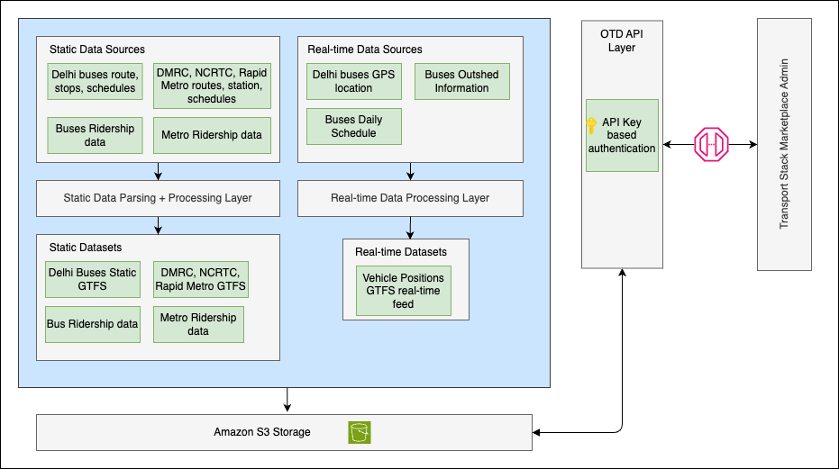

# Open Transit Data (OTD)

## Introduction

The Open Transit Data (OTD) platform aggregates, processes, and disseminates a wide range of transport data, with a focus on Delhi's transit systems. It is designed as a foundational tool for urban planning, real-time traffic management, and commuter information services.

### Purpose
OTD enables seamless data flow from collection to consumption, supporting accuracy, speed, and security for large-scale metropolitan transit data.

### Scope
This document details the OTD platform's technical architecture, data processing pipelines, storage solutions, monitoring systems, and security protocols.

---

## System Architecture

**Figure:** OTD Framework - Static & Real-time Data Flow, API Layer, and Marketplace Integration

### Key Components
- **Data Ingestion Layer:**
  - Real-time data acquisition from GPS and sensors, batch uploads for static datasets (schedules, fares, etc.)
  - High availability, fault tolerance, and rigorous validation for both real-time and static data
- **Data Normalization Service:**
  - Standardizes and validates incoming data (real-time and static)
  - Employs schema validation, anomaly detection, and quality assurance routines
- **Data Processing Layer:**
  - Static Data Management: Versioning, automated updates, and historical records
  - Real-Time Data Processor: Stream processing for ETAs, locations, KPIs; scalable and horizontally distributed
  - Route/Trip Assignment: Combines real-time and static data, handles anomalies
- **Data Storage Layer:**
  - Relational database with spatial capabilities and S3 integration for backups and archival
  - Scalable, cloud-based, with automated lifecycle management
- **Caching & Data Retrieval:**
  - In-memory data store for sub-millisecond access to high-demand data
- **API & User Interface Layer:**
  - API gateway with throttling, analytics, and API key-based authorization
  - User interface for dataset visibility, registration, access requests, and feedback
- **Monitoring & Operations:**
  - Proactive monitoring, alerting, centralized logging, and continuous security assessment

---

## Feature Overview

- **User Interface:**
  - Dataset catalog with metadata
  - User registration and access request forms
  - Feedback and notification systems
- **Data Access:**
  - Static data downloads (CSV, ZIP) and real-time API access (API key required)
  - Comprehensive API documentation (OpenAPI/Swagger)
- **Support & Scalability:**
  - Feedback mechanisms, update notifications, and scalable infrastructure
- **Datasets:**
  - Static: GTFS feeds for buses and metro, parking, fares, ridership, travel patterns
  - Real-Time: Vehicle positions (GTFS-RT), occupancy, parking availability, footfall, travel patterns
- **Technical Requirements:**
  - Version control, automated backups, cloud-native infrastructure, performance monitoring
  - Token-based authentication, network segmentation, SSL/TLS, continuous security assessment

---

## API Structure (Swagger Summary)

### Core Endpoints
- **GET /api/v1/get-file**
  - Parameters:
    - `agency` (required, query): Name of the agency (e.g., `dmrc`)
    - `category` (query): Category of the dataset
    - `filename` (query): Specific filename requested
    - `x-api-key` (required, header): API key for authentication
  - Returns: Requested file if authorized

- **GET /api/v1/list**
  - Parameters:
    - `agency` (query): Name of the agency
    - `category` (query): Dataset category
    - `x-api-key` (required, header): API key for authentication
  - Returns: List of folders and dataset versions

---

## Services and Resources Used

| Category           | Service/Resource         | Purpose/Functionality                      |
|--------------------|-------------------------|--------------------------------------------|
| Cloud Infrastructure | AWS EKS, ECR, S3, RDS, CloudWatch, Elasticsearch | Compute, storage, database, monitoring; real-time streaming |
| Data Processing    | Python scripts          | Real-time analytics                        |
| Data Storage       | AWS RDS PostgreSQL      | Data management                            |
| Caching            | Redis                   | Fast access to frequently requested data    |
| DevOps & CI/CD     | GitHub Actions          | Automated integration and deployment        |
| Monitoring & Logging | CloudWatch             | System health monitoring and centralized logging |
| API Documentation  | Swagger                 | API documentation and testing              |

---

## Documentation & Support

- **User Guides:** Step-by-step guides for platform navigation and dataset access
- **API Docs:** OpenAPI/Swagger-based, with endpoint details, parameters, and examples

For more technical details or support, contact the Transport Stack team.
